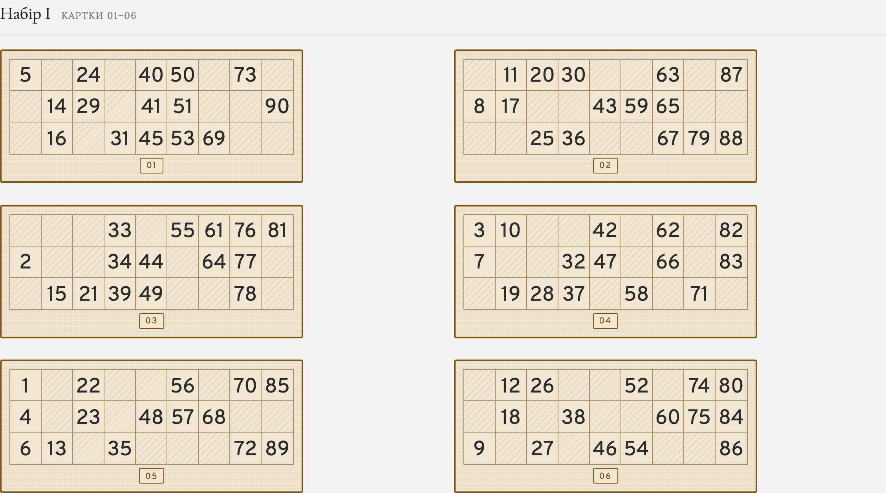
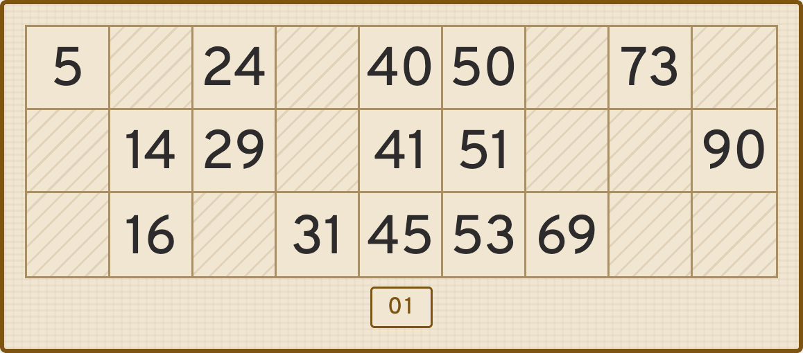

# Лото — генератор карток

Статичний веб-застосунок, що генерує 24 унікальні картки для класичної гри
в лото (90 бочок): кожна картка — 3×9, 15 чисел, а 24 картки складені в
4 незалежні набори по 6, де в межах набору кожне число від 1 до 90
випадає рівно один раз. Готовий макет для друку на A4, а також векторний
SVG-експорт для 3D-друку/ЧПУ.

**Демо:** https://village-elder.github.io/lotto_board_game/



<details>
<summary>Одна картка крупним планом</summary>



</details>

## Можливості

- Генерація нового комплекту з 24 карток одним натиском.
- Друк на A4 (книжкова орієнтація), кожен набір — з нової сторінки, картки
  ніколи не розрізаються між сторінками.
- Завантаження комплекту як JSON (числа + метадані).
- Завантаження SVG-контурів усіх 24 карток (одним ZIP) — справжні векторні
  контури тексту (через розбір гліфів шрифту), а не растр і не системний
  `<text>`. Призначено для 3D-друку/ЧПУ: реальний масштаб у міліметрах.
- Розкривна панель налаштувань із живим прев'ю: кольори, шрифт і розмір
  чисел (включно із завантаженням власного шрифту), стиль порожніх
  клітинок, товщина ліній сітки, геометрія картки, номер картки на бейджі
  (6 позицій), кількість карток у рядку. Готові кольорові заготовки.

## Правила картки

- Сітка 3 рядки × 9 стовпців.
- На картці рівно 15 заповнених чисел, решта 12 клітинок порожні.
- У кожному рядку рівно 5 чисел.
- Кожен стовпець відповідає діапазону чисел:

  | Стовпець | Діапазон |
  |----------|----------|
  | 1        | 1–9      |
  | 2        | 10–19    |
  | 3        | 20–29    |
  | 4        | 30–39    |
  | 5        | 40–49    |
  | 6        | 50–59    |
  | 7        | 60–69    |
  | 8        | 70–79    |
  | 9        | 80–90    |

- У кожному стовпці картки від 1 до 3 чисел, порожніх стовпців немає.
- Числа в межах одного стовпця йдуть за зростанням зверху вниз.

24 картки формуються як 4 незалежні набори ("Набір I–IV") по 6 карток.
Усередині кожного набору кожне число від 1 до 90 зустрічається рівно один
раз (6 карток × 15 чисел = 90), як у справжньому виробництві карток лото.

## Швидкий старт

Це статичний сайт без збірки залежностей (усі сторонні файли вже
вендоровані в `vendor/`).

```bash
git clone <URL цього репозиторію>
cd loto_board_game
python3 -m http.server 8000
```

Відкрити в браузері: http://localhost:8000/

Альтернативно можна просто відкрити `index.html` подвійним кліком —
застосунок працює і без сервера. Інтернет потрібен лише для заголовків і
основного тексту (Cormorant Garamond/Lora з Google Fonts) — генерація
карток, шрифт чисел і SVG-експорт працюють повністю офлайн.

## Дизайн

Візуальний стиль — "Classical": редакційний, паперовий вигляд (заголовки —
Cormorant Garamond, текст — Lora, тепле тло картки, золотисто-коричневий
акцент, лінії замість заливок). Числа на картках — шрифт Overpass,
вендорений локально в `vendor/fonts/` (без мережі, працює офлайн) — саме
тому, що SVG-експорт перетворює цифри на справжні векторні контури через
`vendor/opentype.min.js`, і файл шрифту має бути гарантовано доступний у
форматі, який ця бібліотека вміє розібрати.

## Структура проєкту

- `index.html` — розмітка сторінки: шапка з діями, вступний блок, панель
  налаштувань, аркуш карток, підвал.
- `app.js` — генерація карток (`generateAll`, `countsMatrix`, `rowLayout`),
  рендеринг у DOM, логіка панелі налаштувань, завантаження власного
  шрифту, а також генерація SVG-контурів карток і ZIP-архіву для
  завантаження.
- `style.css` — усі стилі, включно з токенами дизайн-системи (`--color-*`,
  `--font-*`, `--space-*`) і токенами картки (`--card-bg`, `--card-border`
  тощо), а також стилі для друку.
- `vendor/` — вендоровані (локально збережені, не з CDN) сторонні файли:
  - `opentype.min.js` + `opentype-LICENSE.txt` (MIT) — розбір шрифтів і
    побудова векторних контурів символів для SVG-експорту.
  - `fonts/overpass-*.otf` + `OFL-Overpass.txt` (SIL OFL) — типовий
    шрифт чисел, офіційний "desktop"-реліз (v3.000, delvefonts.com/
    redhat.com), чотири насичення (300, 400, 600, 700; без Medium).

## Обмеження

- Налаштування панелі не зберігаються між сеансами: кожне перезавантаження
  сторінки починається з типових значень (натискання "Скинути" робить те
  саме).
- Заголовки/основний текст сторінки (Cormorant Garamond, Lora)
  підключаються з Google Fonts у `index.html` — для їх показу потрібен
  інтернет. Самі картки, числа й SVG-експорт від мережі не залежать.

## Перевірка коректності

Генерація перевірена окремим прогоном (200 ітерацій) поза браузером:
кожна картка має 5 чисел у рядку, 1–3 числа в кожному стовпці з правильним
діапазоном і зростанням зверху вниз, а кожен набір із 6 карток покриває
числа 1–90 рівно по одному разу без пропусків і дублів.

SVG-експорт перевірений окремо: повний прогін генерації 24 файлів
пакується в ZIP і звіряється (`zipfile.testzip`, парсинг кожного файлу
як XML) — без пошкоджень архіву чи помилок розмітки.

Пагінація друку (розбиття на сторінки без розрізання картки навпіл)
перевірена вручну реальним друком у Chrome та Safari.

## Ліцензія

Код проєкту — [MIT](LICENSE). Вендоровані сторонні файли в `vendor/`
залишаються під власними ліцензіями (MIT для `opentype.min.js`, SIL OFL
1.1 для шрифту Overpass) — див. відповідні файли `*LICENSE*` поруч із
ними.
